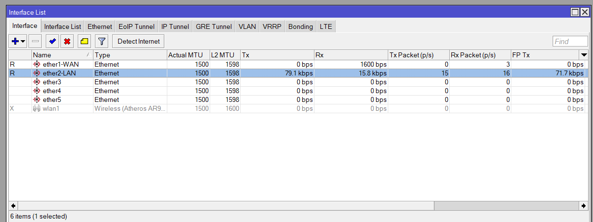
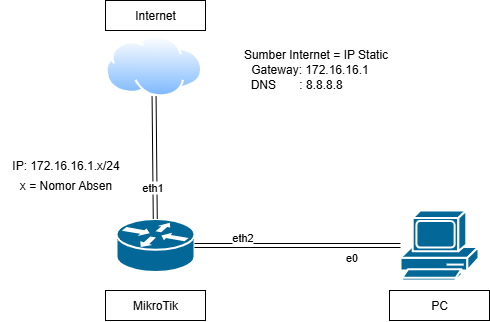

# Mengoneksikan-MikroTik-ke-Internet

Metode pengkoneksian MikroTik ke internet terdapat 2 metode, yaitu sebagai berikut:

# 1. Sumber Internet IP Dynamic
 Topologinya sebagai berikut

Pasangkan pengkabelan LAN sesuai dengan topologi di atas\
Setting nama interface RouterBoard MikroTik:\
ether1-WAN (Untuk koneksi ke internet), dan\
ether2-LAN (Untuk koneksi ke PC Klien)\

Konfigurasi DHCP Client ether1-WAN agar dapat IP dari dari Router Telkom/ISP/Internet
IP > DHCP Client > + Interface = ether1-WAN > Apply > OK

Cek pada tab status, lihat IP yang didapatkan oleh ether1-WAN

Lakukan pengecekan koneksi dari MikroTik ke Internet
New Teminal > ketik perintah ping lalu alamat tujuan

Setelah terkoneksi, setting IP pada interface ether2-LAN
IP > Address > + Address = 192.168.10.1/24
Interface = ether2-LAN
Apply > OK

Lakukan konfigurasi NAT, agar PC Klien dapat terkoneksi Internet melewati Mikrotik:
IP > Firewall > NAT > +
General > Chain > srcnat
Out Interface: ether1-WAN
Action > Masquerade

Konfigurasi IP PC Klien/Laptop
Start > Control Panel > Network and Internet > Network and Sharing Center >Change Adapter Setting > Network Connection
Klik kanan Local Area Connection > Properties > TCP/IPv4 > Properties
Use the following IP address:
IP address: 192.168.10.2
Subnet mask: 255.255.255.0
Default gateway: 192.168.10.1
Use the following DNS server address:
Prefered DNS server: 8.8.8.8
Secondary DNS server: 8.8.4.4

Test koneksi PC Klien/Laptop ke internet melalui cmd
Windows+R > ketik cmd lalu enter
Ketik ping ke alamat tujuan (contoh: ping google.com), jika berahsil maka akan reply seperti berikut

Ketik tracert ke alamat tujuan (contoh: tracert google.com)

# 2. Sumber Internet IP Static
 Topologinya sebagai berikut:
 

Pasangkan pengkabelan LAN sesuai dengan topologi di atas\
Setting nama interface RouterBoard MikroTik: \
ether1-WAN (Untuk koneksi ke internet), dan\
ether2-LAN (Untuk konrksi ke PC Klien)

Konfigurasi DHCP Client ether1-WAN untuk mendapatkan IP default dari ISP (jika sudah mengetahui IP default dari ISP, bisa langsung skip ke bagian setting IP)\
IP > DHCP Client > + Interface = ether1-WAN > Apply > OK

Cek pada tab status, catat IP, DNS, dan Gateway yang didapatkan oleh ether1-WAN untuk nanti dikoneksikan dengan metode static

Hapus DHCP Client
IP > DHCP Client > ether1-WAN > -

Setting IP pada interface ether1-WAN sesuai dengan IP yang didapatkan dari DHCP Client
IP > Address > + Address = 192.168.70.49/24
Interface = ether1-WAN
Apply > OK

Lakukan konfigurasi NAT, agar PC Klien dapat terkoneksi Internet melewati Mikrotik:
IP > Firewall > NAT > +
General > Chain > srcnat
Out Interface: ether1-WAN
Action > Masquerade

Setting DNS sesuai dengan DNS yang didapatkan dari DHCP Client
IP > DNS > + > Primary Servers = 192.168.70.1
Secondary Servers = 8.8.8.8
Apply > OK

Setting Gateway sesuai dengan Gateway yang didapatkan dari DHCP Client

Lakukan pengecekan koneksi dari MikroTik ke Internet
New Teminal > ketik perintah ping lalu alamat tujuan

Setelah terkoneksi, setting IP pada interface ether2-LAN
IP > Address > + Address = 172.16.16.30/25
Interface = ether2-LAN
Apply > OK

Konfigurasi IP PC Klien/Laptop
Start > Control Panel > Network and Internet > Network and Sharing Center >Change Adapter Setting > Network Connection
Klik kanan Local Area Connection > Properties > TCP/IPv4 > Properties
Use the following IP address:
IP address: 10.10.30.202
Subnet mask: 255.255.255.252
Default gateway: 10.10.30.201
Use the following DNS server address:
Prefered DNS server: 192.168.70.1
Secondary DNS server: 8.8.8.8

Test koneksi PC Klien/Laptop ke internet melalui cmd
Windows+R > ketik cmd lalu enter
Ketik ping ke alamat tujuan (contoh: ping google.com)

Ketik tracert ke alamat tujuan (contoh tracert google.com)

Kesimpulan : 
IP Dynamic mempermudah pengguna awam, jika user ingin segera terkoneksi ke internet tanpa harus mengatur IP secara manual
IP Static cocok digunakan untuk user yang ingin belajar mensetting IP secara manual

Sekian yang dapat saya sampaikan, mohon maaf apabila ada salah kata atau kekurangan dalam penyampaian. Akhir kata, Wassalam
